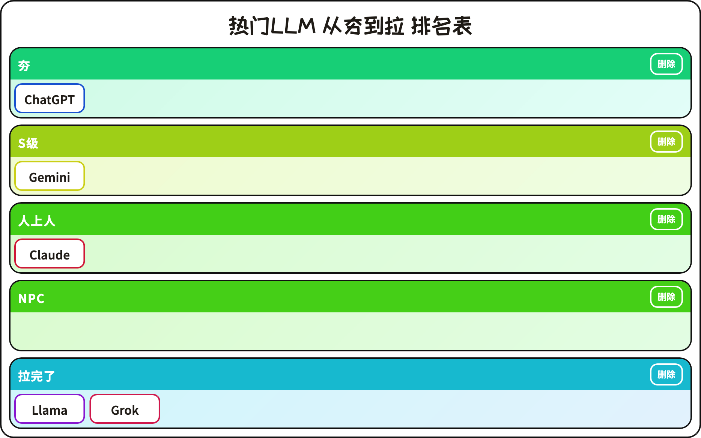

# 从夯到拉 Tier List Maker

[中文](README.md) | [English](README.en.md)

一个纯前端可拖拽的 “从夯到拉” 排名表生成器：创建条目、拖入档位、自由增删/重命名档位，并可一键导出 PNG。  
双击打开 `index.html` 即可使用；状态自动保存到浏览器（localStorage）。

## 在线访问

- https://rank-anything.lyk-love.cn/（推荐：中国大陆可访问）
- https://rank-anything.netlify.app/（海外备选：大陆可能不可用）

## 部署

本站由 Netlify 部署，由 Cloudflare 提供 CDN 加速。

- Netlify: https://app.netlify.com/sites/rank-anything
- Cloudflare: https://dash.cloudflare.com/

> 注意：本项目由Codex（AI）生成。